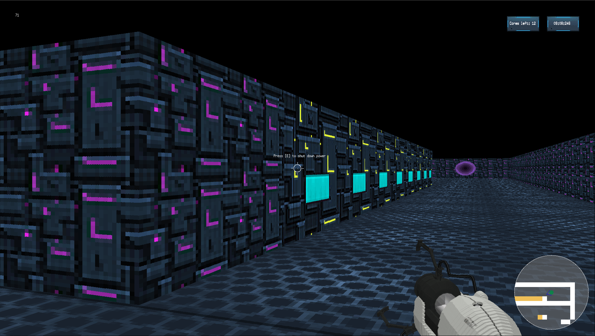

# cub3D

A ray-casting 3D maze exploration game inspired by Wolfenstein 3D, built using the 42 MiniLibX graphics library.



## Overview

cub3D is a first-person 3D maze explorer where players navigate through custom mazes while deactiving overheating cores. The game features a unique portal mechanic for teleportation, and a mission-based gameplay system.

## Compilation and Execution

```bash
make
./cub3d test_maps/fast.cub
```

## Features

- 3D ray-casting engine with textured walls, floors and ceilings
- Portal system for teleportation within the maze
- Core collection gameplay mechanic
- Time-limited missions
- Minimap and full map displays
- Mouse and keyboard controls
- Custom map parsing from .cub files
- Textured floor and ceiling
- HUD with FPS counter and mission stats
- Sprint ability

## Controls

- **W, A, S, D** - Move in the maze
- **Left/Right Arrow Keys** - Rotate camera
- **Mouse Movement** - Rotate camera
- **Left/Right Mouse Button** - Create portals
- **E** - Interact with cores
- **M** - Toggle mouse visibility
- **Shift** - Sprint
- **Tab** - Show full map
- **ESC** - Exit the game

## Map Configuration

Maps use .cub files that can include the following parameters:

- Texture paths for different wall directions (NO, SO, WE, EA)
- Floor and ceiling colors (F, C) in RGB format
- Optional time limit (TIMER)
- Map layout using characters:
  - 1: Wall
  - 0: Empty space
  - C: Core to collect
  - N/S/E/W: Player starting position and orientation

## Acknowledgments

- Project created as part of the curriculum at [School 19](https://s19.be/)

## Authors

- **maxweert** - [GitHub profile](https://github.com/mweerts)
- **llebugle** - [GitHub profile](https://github.com/llebugle)